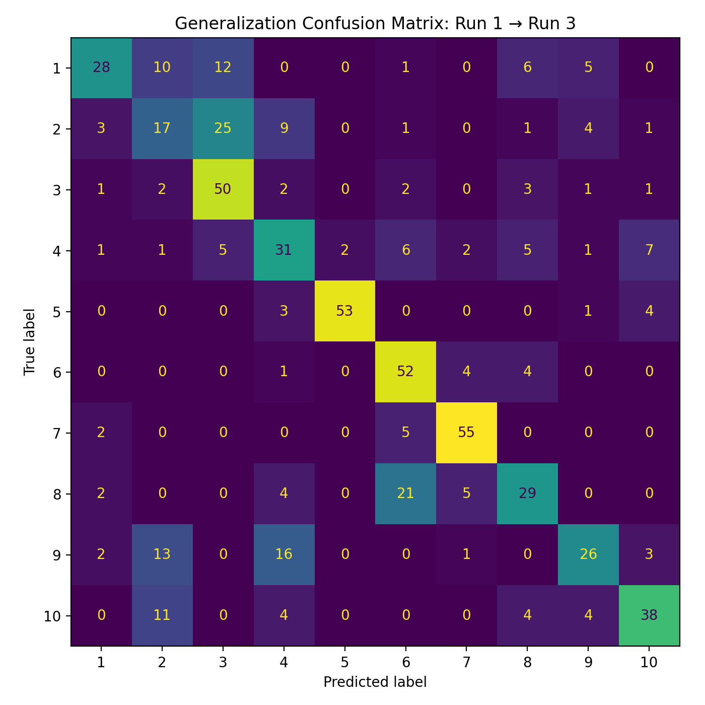
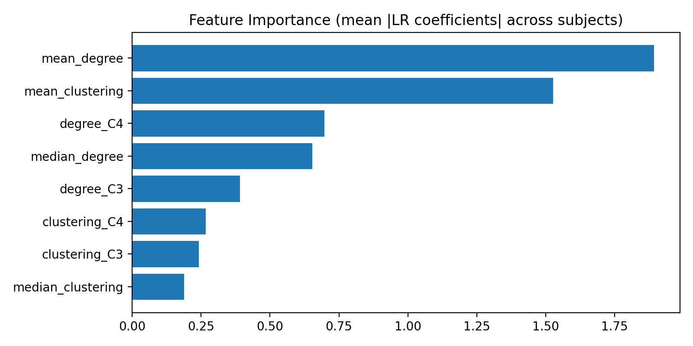

# EEG Subject Identification via Functional Connectivity  
### EEG “Fingerprinting” Across Brain States

## Overview
This project investigates whether **individual-specific signatures** exist in EEG functional connectivity and whether these signatures **generalize across cognitive states**. Using the PhysioNet EEG Motor Movement/Imagery Dataset (EEGMMIDB), we build an end-to-end pipeline that:

1. Processes raw EEG recordings  
2. Computes **alpha-band functional connectivity**  
3. Extracts **graph-theoretic features**  
4. Trains a machine learning model to **identify which subject produced an EEG segment**

Critically, we evaluate not only within-session identification but also **cross-condition generalization**, training on resting-state EEG and testing on motor imagery EEG.

---

## Key Result
A logistic regression model trained on **resting-state EEG (Run 1)** achieved **61.8% accuracy** when identifying subjects from **motor imagery EEG (Run 3)** across a 10-subject cohort, substantially exceeding the **10% chance baseline**.

This result suggests that **subject-specific EEG connectivity patterns are stable across brain states**, supporting the concept of EEG “fingerprinting.”

---

## Dataset
**Source:** PhysioNet EEG Motor Movement/Imagery Dataset (EEGMMIDB)  
**Accessed via:** `mne.datasets.eegbci`

- 64-channel scalp EEG (10–20 system)  
- Sampling rate: 160 Hz  
- Multiple runs per subject under different task conditions  

### Subjects
- Subjects 1–10 (10 total)

### Conditions Used
- **Run 1:** Baseline, eyes open (training condition)  
- **Run 3:** Motor imagery (testing condition for generalization)

---

## Methodology

### 1. Preprocessing
Each subject’s raw EEG is processed using MNE:

- Bandpass filtering: **1–40 Hz**  
- Average EEG reference  
- Standardized channel metadata and 10–20 montage  
- Non-EEG channels removed  

This step removes noise and ensures consistent channel identity across subjects.

---

### 2. Epoching
Continuous EEG is segmented into **fixed-length, non-overlapping epochs**:

- Epoch length: **2 seconds**  
- ~30 epochs per subject per run  

Each epoch is treated as an independent sample for downstream analysis.

---

### 3. Functional Connectivity
For each epoch, **alpha-band (8–13 Hz) functional connectivity** is computed using:

- **Metric:** Coherence  
- **Spectral estimation:** Multitaper  
- **Output:** One connectivity matrix per epoch (64 × 64)  

Alpha-band coherence captures rhythmic synchronization patterns that are known to vary across individuals.

---

### 4. Graph Construction
Each connectivity matrix is interpreted as a weighted, undirected graph:

- **Nodes:** EEG channels  
- **Edges:** Alpha-band coherence values  

To ensure comparability across epochs, only the **top-k strongest connections** are retained per epoch, enforcing a fixed graph density.

---

### 5. Feature Engineering
From each epoch-level connectivity graph, we extract **low-dimensional, interpretable features**:

- Mean weighted degree  
- Median weighted degree  
- Mean clustering coefficient  
- Median clustering coefficient  
- Node-specific degree and clustering at **C3 and C4** (motor cortex landmarks)  

These features summarize both global and local network organization while minimizing overfitting risk.

---

### 6. Machine Learning Model
- **Classifier:** Multiclass Logistic Regression  
- **Pipeline:**  
  - StandardScaler (fit within training data only)  
  - L2-regularized Logistic Regression  

---

## Evaluation

### Within-Session Identification
- **Method:** Stratified 5-fold cross-validation across epochs  
- **Metric:** Accuracy  
- **Baseline:** 10% (random chance for 10 subjects)  

This validates that subject identity can be learned from connectivity features within the same recording session.

---

### Cross-State Generalization (Primary Result)
- **Train:** Run 1 (resting state)  
- **Test:** Run 3 (motor imagery)  
- **Accuracy:** **61.8%**  
- **Chance baseline:** 10%  

This demonstrates that subject-specific EEG connectivity patterns persist across different cognitive states.

---

## Visualizations

### Cross-State Generalization Confusion Matrix (Run 1 → Run 3)


### Feature Importance (Logistic Regression Coefficients)


Confusion matrices show strong diagonal structure, indicating consistent subject identification rather than random guessing.

---

## Results Summary

| Evaluation Type | Accuracy |
|-----------------|----------|
| Chance baseline | 10% |
| Cross-state generalization (Run 1 → Run 3) | **61.8%** |

---

## Tools & Libraries
- **Python 3.x**  
- **MNE-Python** – EEG preprocessing, referencing, epoching, and dataset access  
- **mne-connectivity** – Spectral connectivity estimation (coherence)  
- **NumPy** – Numerical computation  
- **Pandas** – Data handling and feature tables  
- **NetworkX** – Graph construction and graph-theoretic metrics  
- **scikit-learn** – Machine learning models, preprocessing, and evaluation  
- **Matplotlib** – Visualization and plotting  

---

## Limitations
- Small cohort size (10 subjects), which limits population-level generalization  
- Epochs extracted from the same recording session are not fully independent  
- Coherence-based connectivity is sensitive to volume conduction and shared sources  
- Analysis is based on a single dataset and recording session  
- Results may be influenced by fixed electrode placement and referencing choices  

These limitations are common in EEG fingerprinting studies and motivate further investigation.

---

## Future Directions
- Incorporate additional frequency bands (e.g., beta, theta)  
- Expand to larger and more diverse subject cohorts  
- Compare graph-based features with high-dimensional connectivity representations  
- Apply group-aware or subject-wise cross-validation strategies  
- Test cross-day or cross-session generalization  
- Explore alternative connectivity measures (e.g., PLV, imaginary coherence)  
- Investigate longitudinal stability of EEG fingerprints  

---

## Acknowledgments
- **PhysioNet** for providing the EEG Motor Movement/Imagery Dataset (EEGMMIDB)  
- **MNE-Python** developers for open-source EEG analysis tools  

## How to Run

```bash
pip install -r requirements.txt
jupyter notebook

